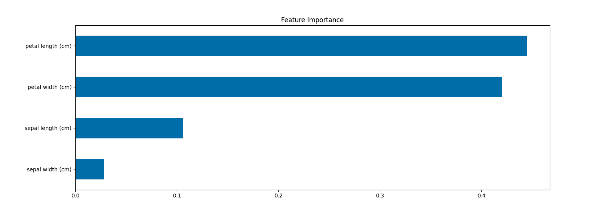
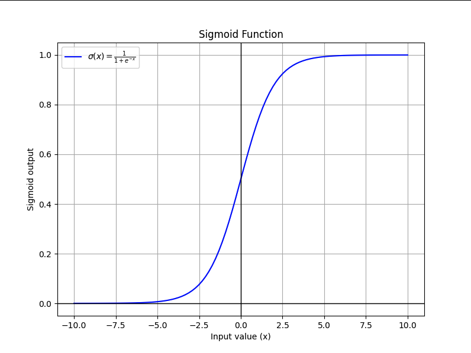

# How do Machine Learning Models Work?

## ⭐️ Table of Contents

- [1️⃣ Decision Tree Classification](#1️⃣-decision-tree-classification)
- [2️⃣ Random Forest Classifier](#2️⃣-random-forest-classifier)
- [3️⃣ Logistic Regression](#3️⃣-logistic-regression)

## 1️⃣ Decision Tree Classification

A **Decision Tree** is a type of machine learning algorithm used for classification and regression tasks. In classification, it predicts the category or class of a data point by asking a series of "yes/no" questions. It mimics human decision-making, which makes it easy to understand.

### How Does a Decision Tree Work?

Think of it as a flowchart:

1. **Root Node**: This is the starting point, representing the entire dataset.
2. **Decision Nodes**: These are intermediate points where the dataset is split based on a condition (a "question").
3. **Leaf Nodes**: These are the endpoints, where the final class label (output) is decided.

For example:

- Question at a node: _Is the temperature greater than 30°C?_
  - If **yes**, go to the next question on one branch.
  - If **no**, follow a different branch.

### Key Components of a Decision Tree

1. **Splitting**: Dividing the dataset based on a feature and a threshold.

   - Example: Split on the feature `temperature` with a threshold of `30°C`.

2. **Impurity**: Measures how "mixed" the data is at a node. A node is pure if all data points belong to the same class.

   - Common measures of impurity:
     - **Gini Impurity**: Measures the probability of incorrect classification at a node.
     - **Entropy**: Measures the randomness or disorder in the dataset.

3. **Information Gain**: The reduction in impurity when a split is made. The algorithm tries to maximize this gain at each step.

   - Formula for Information Gain: **Information Gain = Impurity Before Split - Weighted Impurity After Split**

4. **Stopping Criteria**: The tree stops growing when:

   - A node becomes pure (all data points belong to one class).
   - A maximum tree depth is reached.
   - A minimum number of samples per node is achieved.

5. **Prediction**: Once the tree is built, new data points are classified by traversing the tree from the root to a leaf.

### Example

Let's classify fruits into "Apple" or "Orange" based on two features:

- **Weight (grams)**
- **Color (red or orange)**

#### Steps

1. **Root Node**: Start with the whole dataset.

   - Question: _Is the weight > 150g?_
     - **Yes**: Move to one branch.
     - **No**: Move to another branch.

2. **Split Data**: Based on the answer, split the dataset.

3. **Next Question**: For each branch, ask another question, like _Is the color red?_

   - Continue splitting until each branch ends with a single class.

4. **Leaf Nodes**: Each leaf represents the final prediction, either "Apple" or "Orange".

### Advantages of Decision Trees

1. **Easy to Understand**: Visualizes decision-making like a flowchart.
2. **No Need for Scaling**: Works well with raw data (e.g., no need to normalize features).
3. **Handles Both Categorical and Numerical Data**.

### Disadvantages

1. **Overfitting**: A deep tree might memorize the training data, performing poorly on new data.
   - **Solution**: Use pruning techniques or limit tree depth.
2. **Bias Towards Dominant Features**: If one feature dominates others, it might skew the splits.
3. **Instability**: Small changes in data can result in a completely different tree.

### Implementation in Python (Using Scikit-learn)

Check it out [here](./decision_tree_classifier.py).

### **Visualizing the Tree**

### Resources

- [Decision Tree Classification Clearly Explained](https://www.youtube.com/watch?v=ZVR2Way4nwQ)

## 2️⃣ Random Forest Classifier

[Link to official documentation](https://scikit-learn.org/1.5/modules/generated/sklearn.ensemble.RandomForestClassifier.html)

The **Random Forest Classifier** is an ensemble learning method that builds multiple decision trees and combines their outputs to make more accurate and stable predictions. It is widely used because of its simplicity, flexibility, and high performance. It is basically a better version of a decision tree since it is a collection of them.

### How Does a Random Forest Work?

1. **Building Multiple Trees**:

   - The algorithm creates several decision trees using different subsets of the training data.
   - Each tree is trained independently on a random sample of the data (with replacement, known as **bootstrap sampling**).

2. **Making Predictions**:

   - For classification, each tree votes for a class.
   - The class with the majority of votes across all trees becomes the final prediction.

### Why Use Multiple Trees?

- **Reduces Overfitting**: A single decision tree can overfit the data, especially if it’s very deep. Combining multiple trees reduces this risk.
- **Improves Accuracy**: Aggregating the outputs of multiple trees produces better predictions.
- **Handles Variability**: By using random samples and feature selection, Random Forest reduces the impact of noisy or irrelevant data.

### Key Features of Random Forest

1. **Randomness in Data**:
   - Each tree is trained on a random subset of the data, known as **bootstrap sampling**.
2. **Randomness in Features**:
   - At each split in a tree, the algorithm considers only a random subset of features instead of all features.
3. **Aggregation (Voting)**:
   - For classification, the final prediction is based on majority voting from all trees.

### Criterion in Random Forest

The **criterion** parameter works the same as in a Decision Tree. It determines how splits are evaluated in individual trees:

- **`criterion='gini'`**: Uses Gini impurity to measure node purity.
- **`criterion='entropy'`**: Uses entropy to measure disorder or randomness.

Each tree in the forest tries to **minimize** the chosen criterion at every split.

### Advantages of Random Forest

1. **Highly Accurate**: Combines the strengths of multiple decision trees.
2. **Robust to Overfitting**: Reduces overfitting compared to a single decision tree.
3. **Works with Both Categorical and Numerical Data**.
4. **Handles Missing Data**: Can handle incomplete datasets effectively.

### Disadvantages

1. **Computationally Intensive**: Training multiple trees requires more time and resources than a single decision tree.
2. **Less Interpretability**: It’s harder to interpret the results compared to a single decision tree.
3. **Feature Importance May Be Biased**: Tends to give higher importance to features with more levels.

### Implementation in Python (Using Scikit-learn)

Check it out [here](./random_forest_classifier.py).

### **Important Parameters in Random Forest**

- **`n_estimators`**: The number of trees in the forest (default is 100). More trees can improve accuracy but increase computation time.
- **`max_depth`**: The maximum depth of each tree. Limiting depth prevents overfitting.
- **`min_samples_split`**: The minimum number of samples required to split a node.
- **`max_features`**: The number of features to consider when looking for the best split.
  - `auto` or `sqrt`: Square root of the total number of features (default for classification).
  - `log2`: Logarithm (base 2) of the total number of features.

---

### **Visualizing Feature Importance**

### Resources

- [Random Forest Algorithm Clearly Explained](https://www.youtube.com/watch?v=v6VJ2RO66Ag)

## 3️⃣ Logistic Regression

[Link to official documentation](https://scikit-learn.org/1.5/modules/generated/sklearn.linear_model.LogisticRegression.html)

The **Logistic Regression** model is a widely used algorithm for binary and multi-class classification problems. Despite its name, it's not a regression algorithm—it is a classification model that predicts the probability of a class based on input features.

### How Does Logistic Regression Work?

1. **Linear Model**:

   - Logistic regression starts with a linear model, calculating a weighted sum of the input features:
     $$
     z = w_1x_1 + w_2x_2 + \dots + w_nx_n + b
     $$
     where $w$ are the weights, $x$ are the input features, and $b$ is the bias term.

2. **Applying the Sigmoid Function**:

   - The weighted sum (\( z \)) is then passed through a **sigmoid function** to map the output to a probability range between 0 and 1:
     $$
     \sigma(z) = \frac{1}{1 + e^{-z}}
     $$
   - This probability represents the likelihood that the input belongs to the positive class.

3. **Decision Boundary**:
   - A threshold (commonly 0.5) is applied to the probability:
     - If $\sigma(z) \geq 0.5$: classify as the positive class.
     - If $\sigma(z) < 0.5$: classify as the negative class.

### Why is it Called "Logistic"?

- The name comes from the use of the **logistic function**, also known as the sigmoid function, which maps any real-valued number to the range \([0, 1]\).
- Logistic regression models the **log-odds** of the positive class as a linear combination of the input features.

---

### Key Features of Logistic Regression

1. **Linear Decision Boundary**:

   - It assumes the relationship between features and the log-odds of the target is linear.

2. **Output is Probabilistic**:

   - Instead of directly predicting a class, logistic regression predicts probabilities.

3. **Interpretable Coefficients**:
   - The model coefficients indicate the influence of each feature on the log-odds of the target.

### Advantages of Logistic Regression

1. **Simple and Efficient**:

   - Easy to implement and computationally efficient, even with large datasets.

2. **Interpretable**:

   - Coefficients can be directly interpreted to understand the impact of each feature.

3. **Robust to Noise**:

   - Works well with linearly separable data and small to medium-sized datasets.

4. **Probabilistic Predictions**:
   - Useful when you need class probabilities rather than hard classifications.

### Disadvantages

1. **Linear Assumption**:

   - Assumes a linear relationship between features and the log-odds, which may not hold in complex datasets.

2. **Not Suitable for Complex Relationships**:

   - Struggles with non-linear patterns unless features are transformed.

3. **Sensitive to Outliers**:

   - Outliers can distort the model as it uses linear combinations of features.

4. **Feature Engineering is Crucial**:
   - Performance depends on the quality of features provided.

### Implementation in Python (Using Scikit-learn)

You can view it [here](./logistic_regression.py).

### **Important Parameters in Logistic Regression**

- **`penalty`**: Specifies the type of regularization to use (e.g., `l2` for Ridge, `l1` for Lasso).
- **`C`**: Inverse of regularization strength. Smaller values indicate stronger regularization.
- **`solver`**: Algorithm used for optimization (e.g., `lbfgs`, `saga`).
- **`multi_class`**: Specifies handling for multi-class problems (`ovr` or `multinomial`).

### Visualizing the Sigmoid Function

Here’s how the sigmoid function maps inputs to probabilities:

### Easy Explanation

Sure! Let's break down **Logistic Regression** in a very simple way.

#### Imagine this

You're trying to sort a bunch of fruits into two groups: apples and oranges. But instead of looking at the fruits directly, you're looking at their size and color. You want to create a rule to decide whether a fruit is an apple or an orange based on these two things.

#### How Logistic Regression Helps

Logistic Regression is like a "smart rule maker" that helps you figure out a line or a curve (which we call the "decision boundary") to divide the apples from the oranges based on their size and color.

#### Here's How It Works

1. **Looking at Data**: You look at the size and color of the apples and oranges in the past (this is called the "training data"). This helps the rule maker learn how to tell the difference between apples and oranges.

2. **Making Predictions**: Once the rule is made, when a new fruit comes in, the rule looks at its size and color and tries to predict if it's more likely to be an apple or an orange. The rule gives a number between 0 and 1 to show how likely it is to be an apple or an orange:

   - A number closer to 1 means it’s probably an apple.
   - A number closer to 0 means it’s probably an orange.
   - If the number is 0.5, the fruit is about equally likely to be either.

3. **Making a Decision**: To make the final decision, we pick a threshold, say 0.5:
   - If the number is **greater than or equal to 0.5**, we call it an apple.
   - If it’s **less than 0.5**, we call it an orange.

#### The Cool Thing

The magic behind the rule is something called the **sigmoid function**, which is just a fancy way of squishing numbers between 0 and 1, so the rule can decide if it's closer to an apple or an orange.

#### Example

Let’s say we have these fruits:

- Apples: Size = 7, Color = Red
- Oranges: Size = 5, Color = Orange

After looking at these examples, the rule might figure out that big red fruits are apples, and smaller orange fruits are oranges. It draws a line (or curve) between them.

When a new fruit comes, say a **medium-sized red fruit**, the rule will check the size and color, and it will give a probability. If this probability is greater than 0.5, it will say, "This fruit is probably an apple!"
